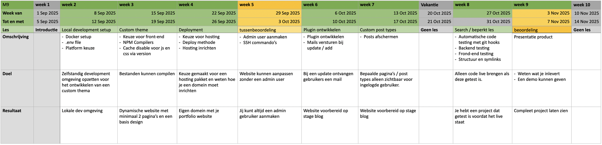

## Voor docent en student
[Complete lesbrief](https://jheidebrink-ma.github.io/m9prog_opdrachtensite/lesbrief): leerdoelen, didactiek, lesverloop en beoordeling per lesmoment.  
[M9 Leercoach](https://jheidebrink-ma.github.io/m9prog_opdrachtensite/m9-leercoach): een interactieve prompt voor uitleg, planning, feedback en debugging.  
[Projectomschrijving](https://jheidebrink-ma.github.io/m9prog_opdrachtensite/project_description): de eisen voor het live portfolio.  